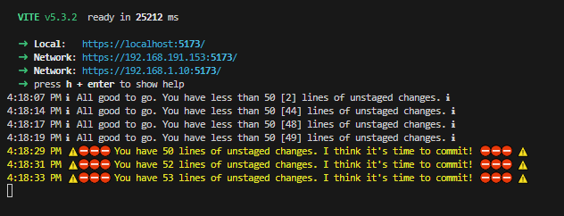

# Git Diff Reminder

Adds a simple reminder on the vite development console to remind the developers to push code when a certain number of lines of code gets changed.

Usage:

```js
import gitDiffReminder from 'vite-plugin-git-diff-reminder';

// Use default config values (see below on what the default values are)
export default defineConfig(() => {
  return {
    plugins: [gitDiffReminder()]
  }
})

// Config values you can modify
export default defineConfig(() => {
  return {
    plugins: [
      gitDiffReminder({
        // All config values here are their corresponding default values.
        // You may override them if needed or leave them empty.
        ignoredPaths: ['.svelte-kit/'],
        command: 'git --no-pager diff',
        threshold: 50,
        customInfo: 'All good to go. You have less than {threshold} [{totalLinesChanged}] lines of unstaged changes.',
        customWarn: "⛔⛔⛔ You have {totalLinesChanged} lines of unstaged changes. I think it's time to commit! ⛔⛔⛔",
      }) /**...your other plugins here*/,
    ],
    //...the rest of your vite config
  };
});
```

Demo:


